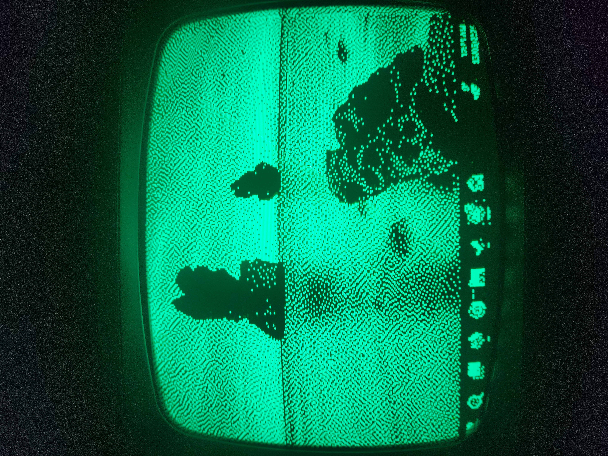
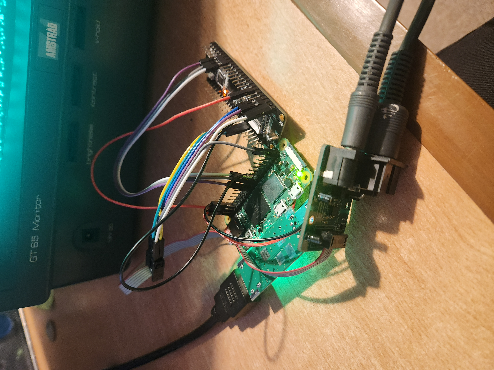
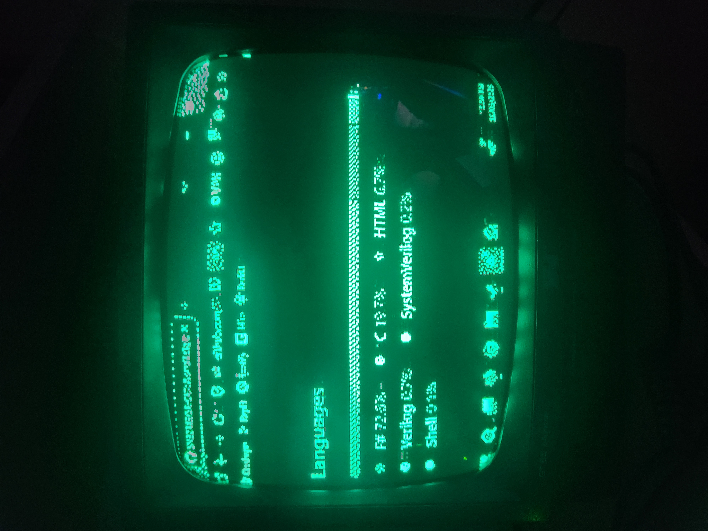
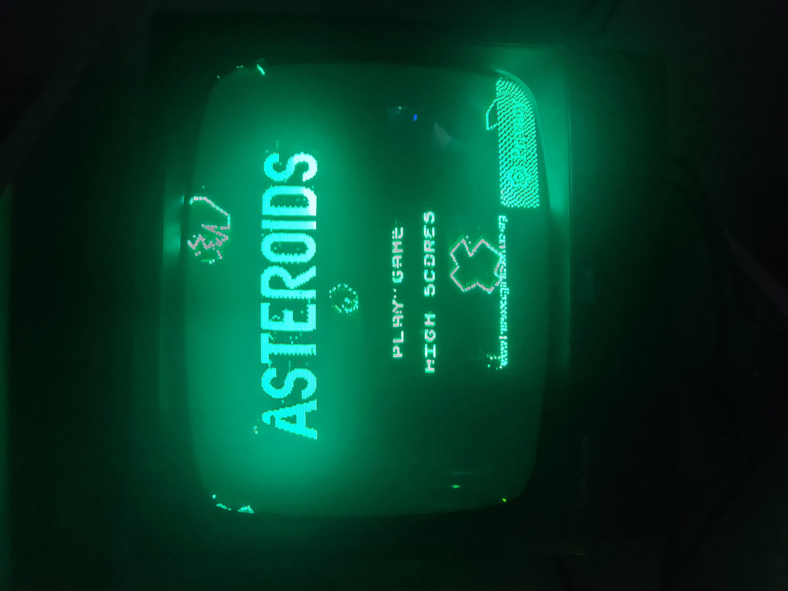
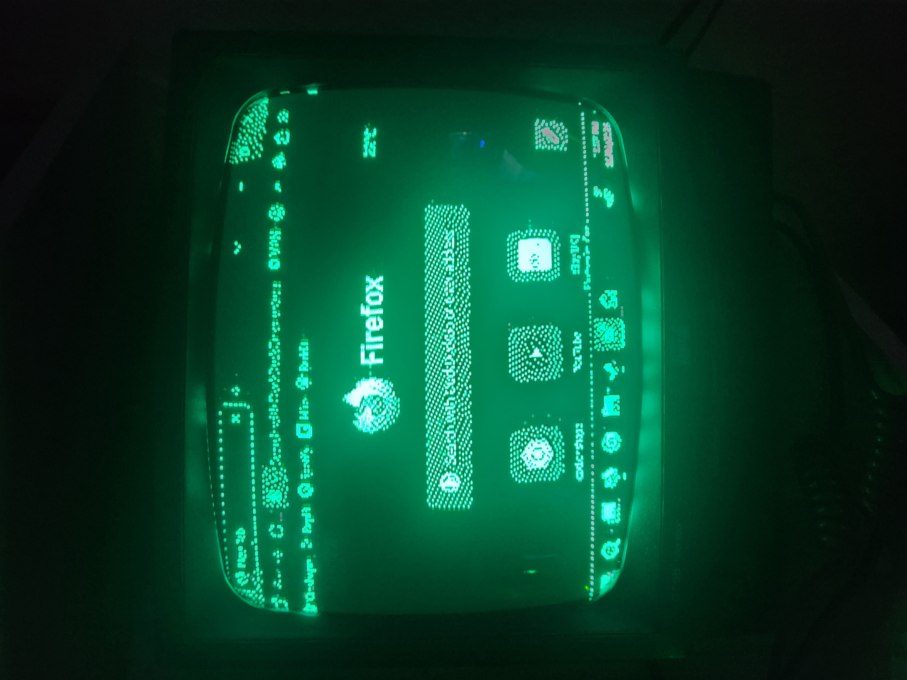
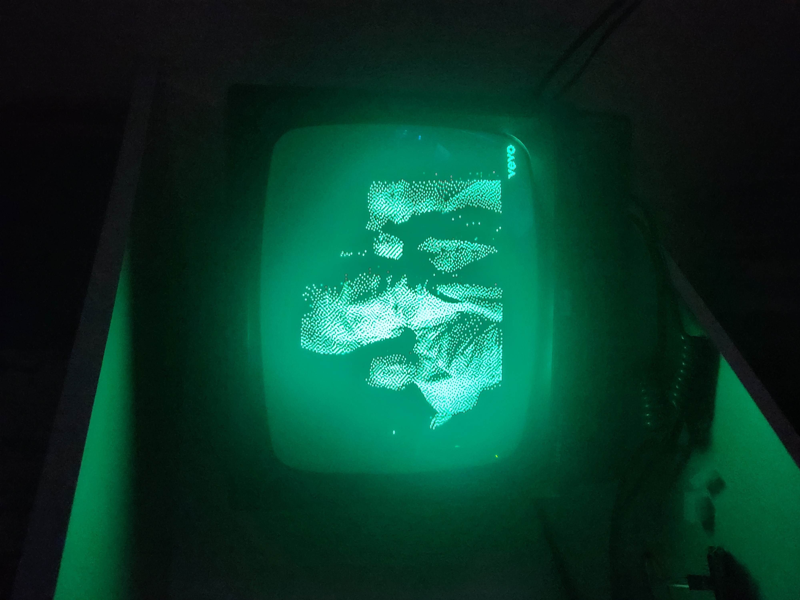

# CRT HDMI Bridge

Live HDMI video on a vintage monochrome CRT, via a Raspberry Pi, an FPGA and a custom interface PCB.

A desktop PC outputs HDMI to a USB capture card on a Raspberry Pi Zero 2 W. The Pi downscales the feed to 296x256, dithers it to 1 bit per pixel using Atkinson dither, and streams it over SPI to an FPGA. The FPGA then drives the Amstrad GT65 CRT monitor at 50 Hz.



## Hardware

- Raspberry Pi Zero 2 W
- UVC-compliant HDMI capture card (MS2130-based works well)
- Sipeed Tang Nano 9K (or any small FPGA with LVDS output and at least 16kiB Block SRAM)
- Custom interface PCB (The files are provided if you wish to have it fabricated - or if you would rather I still have some spare which can be bought. Enquire for more info)
- Amstrad GT65 monochrome CRT monitor
- 5V power supply (Or you can use the CRT's own 5V output)



## How it works

```
PC --HDMI--> Capture Card --USB--> Pi --SPI--> FPGA --LVDS--> Interface PCB --Serial--> CRT
```

The Pi does the heavy lifting in software (capture, scale, dither). The FPGA does the time-critical CRT signal generation in hardware. SPI between them runs at 50 MHz and carries one 9472-byte framebuffer per CRT frame. The interface PCB acts as a level shifter as well as (depending on the setup) an electrical isolator. 
In theory the CRT could be directly driven using a level shifter from the FPGA, but you are on your own if you wish to attempt that.

In Windows 11 itself the monitor is set to 640x480 at 60 Hz.



## Setup

For the Raspberry Pi side, see [RPi/INSTALL.txt](pi/INSTALL.txt). The short version:

1. Flash Raspberry Pi OS Lite (64-bit) with WiFi and SSH preconfigured
2. `scp` the contents of `RPi/` to the Pi
3. Run `./setup_pi.sh` and reboot

For the FPGA side, open the project in your toolchain of choice and flash to your board. Pin assignments are in the top-level constraints file.
You can flash the [FPGA/SPI_to_CRT/impl/pnr/SPI_to_CRT.fs](SPI_to_CRT.fs) binary file directly if you have a GW1NR-LV9C (Tang Nano 9K) FPGA. Otherwise you will need to resynthesise etc.

## Acknowledgements

The Raspberry Pi software was written by Claude (Anthropic) under my supervision. The FPGA work and the rest is mine. For enquiries, contact contact@stanleybooth.uk.

## License

This project is licensed under the MIT License — see [LICENSE](LICENSE) for details.

## Gallery

Here are some more photos of the CRT in action. These photos do not capture the real feeling of the CRT particularly well. It looks much better in real life, especially when displaying videos or things that move as the ghosting leaves a very cool effect. The dithering also provides an incredible amount of information given the limited pixels. It really has to be seen in person to truly appreciate.


Asteroids online


Firefox


A frame from the song "Hip to Be Square" by Huey Lewis and the News on youtube.